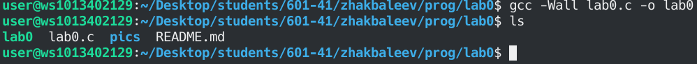

# Отчет

#  Задания для самостоятельного выполнения

Сложность:
    Rare

    Создайте репозиторий для дисциплины на GitHub.
    Склонируйте его себе на ПК.
    Напишите свою первую программу.
    Скомпилируйте и запустите её.
    Получите по отдельности результаты каждого этапа компиляции.
    Напишите отчёт в README.md. Отчёт должен содержать:
        Задание
        Описание проделанной работы
        Консольные команды
        Скриншоты результатов
        Ссылки на используемые материалы
    Сделайте коммит и пуш.
    Добавьте для себя в отчёт шпаргалку по работе с git.


```c
#include <stdio.h>

int main()
{
    printf ("золотая чаша,золотааааая!\n");
    return 0;
}
```


**изобрежение,которое видно на этом этапе**
представляет собой коды которые **показывает исходные файлы*
# Следущие 

# результат исходной команды что была ранее сделана

# Переход в текстовый редактор* 

# Показания всех выполненых команд "компьютером"

# Просмотор файл в исходинке

# просмотор другого исходного Текстого файла

# Добавления исходного файла

# Что то не понятное 

# *ОТЧЕТ ЗАКОНЧЕН*